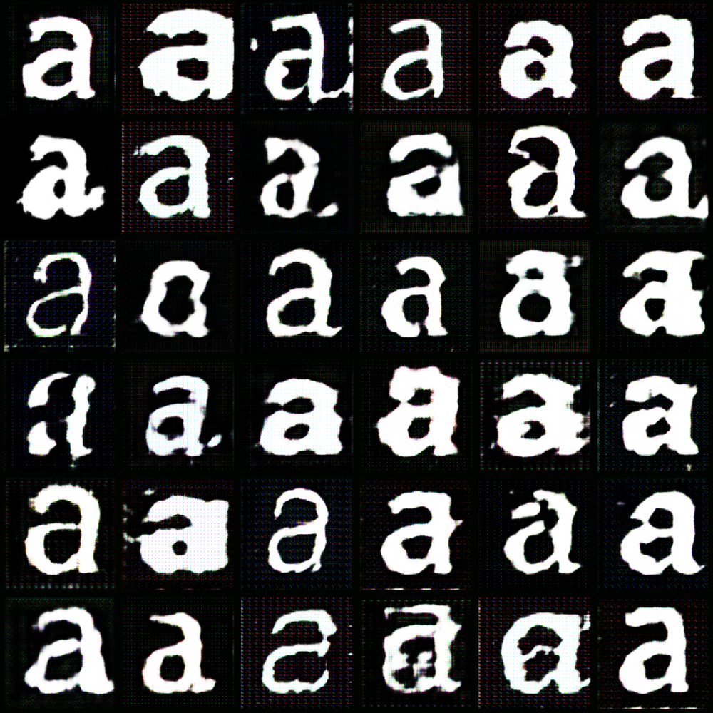

# GylphGAN

Pytorch based deep convolutional GAN trained on glyphs. Original architecture by [Ritchie Vink](https://www.ritchievink.com/blog/2018/07/16/generative-adversarial-networks-in-pytorch-the-distribution-of-art/), adapted by [
Aleksi Halttunen](https://github.com/aleksihalt/DCGAN_interpolation), and implemented by [Moritz Salla](https://github.com/moritzsalla).



Make sure to place your dataset in a subdir from root:

```python
data = torch.utils.data.DataLoader(ImageFolderEX(".", trans),
       batch_size=batch_size, shuffle=True,
       drop_last=True, num_workers=2)
```

```
.
└── 1
    ├── img1.jpg
    ├── img2.jpg
    └── img3.jpg
```
