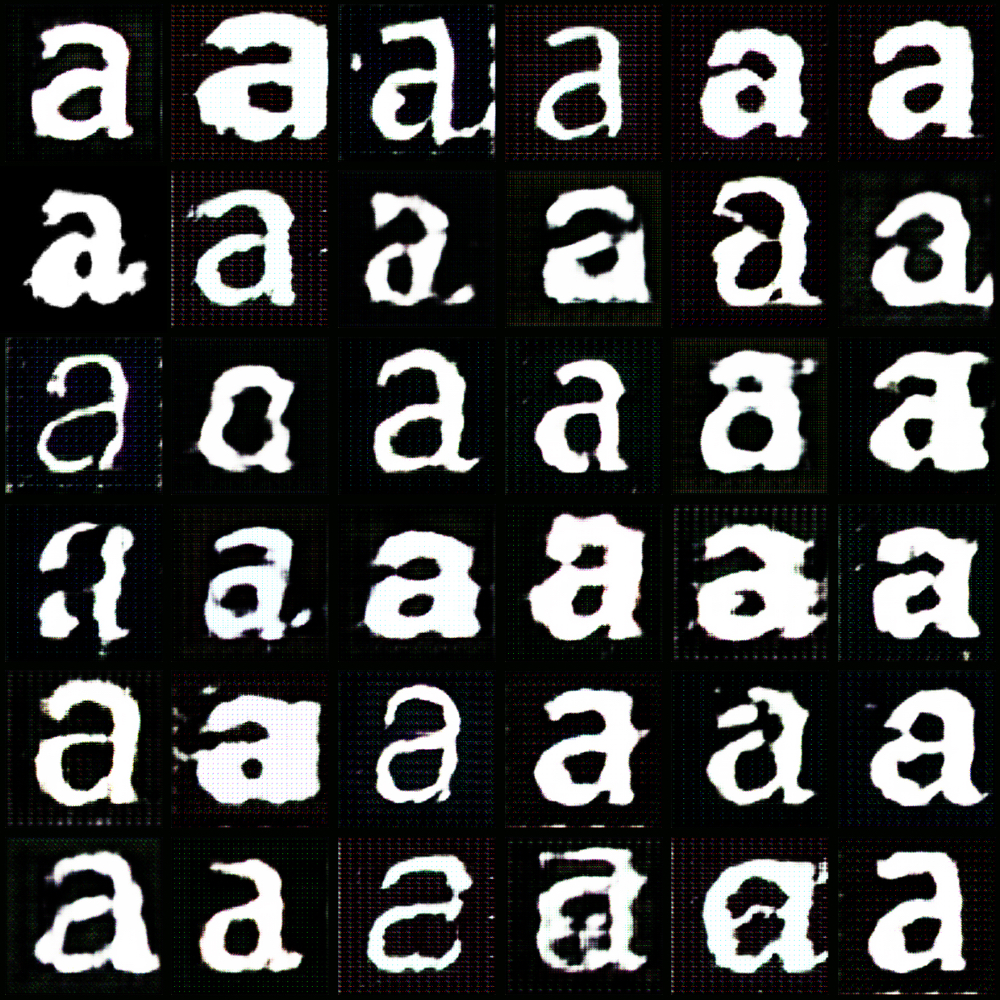

# GlyphGAN



GlyphGAN trains a DCGAN on rasterised glyphs and renders a video that walks
through the latent space between them. The interpolation is the output: one
letterform morphing continuously into another through shapes that sit between
real typefaces.

## How it works

A DCGAN pairs a generator, which turns a random latent vector into an image,
against a discriminator that tries to tell generated glyphs from real ones.
Training the two against each other leaves the generator with a continuous
space of letterforms that can be walked through and sampled.

The model lives in `glyphgan.py`. `glyphgan.ipynb` is a thin driver over it.

## Dataset

Any folder of images laid out for `torchvision.ImageFolder` works — one
subdirectory per class, images inside.

To build one from the fonts installed on a Mac, use
[fontscrape](https://github.com/latentcollection/macOS-fontface-scraper):

```sh
fontscrape --glyphs a --size 64 --mode xheight --per-family 3 --manifest --out dataset/
```

`--glyphs` writes one subdirectory per character. `--per-family 3` caps how many
weights each family contributes, which stops whichever families you happen to
own the most of from pulling the latent space toward themselves.

A single letter gives a model of that letter's design space, which interpolates
cleanly. Training on all 26 unconditioned averages them into mush.

## Usage

```sh
pip install -r requirements.txt
```

Then either run the notebook, or drive the module directly:

```python
import glyphgan as gg

gg.train("dataset/", size=64, max_steps=20000, batch_size=32)
gg.render_interpolation("checkpoints/generator.pt", "render.mp4", keys=8, frames=60)
```

Training checkpoints to `checkpoints/` every few thousand steps and on exit, including
Ctrl-C, and resumes from the latest checkpoint automatically. Rendering reads a
checkpoint from disk and needs nothing from the training session, so a video can
be made at any point from any run.

## Hyperparameters

| | Default | |
|---|---|---|
| `size` | `64` | output resolution; a power of two. Layer count follows it |
| `channels` | `256` | feature count at the 4×4 stage, halving outward |
| `max_steps` | `20000` | optimiser steps; the real training budget |
| `batch_size` | `32` | |
| `lr` | `2e-4` | from the DCGAN paper |
| `betas` | `(0.5, 0.999)` | likewise |
| `LATENT` | `200` | latent vector size |

Start at 64px. A crisp small model that interpolates smoothly is more useful
than a soft large one, and a few thousand glyphs will not support a 256px
discriminator without memorising them.

Budget training in **steps, not epochs**. A few hundred glyphs make an epoch
only a handful of steps, so an epoch count carried over from a large dataset
trains for almost no time at all. Aim for 20,000+ steps, and raise `channels` only
as the dataset grows — at `1024` the model has more parameters than it has
pixels to fit, and the generator collapses to a fixed pattern that ignores its
latent input entirely.

## Performance

Measured on a 2017 Intel MacBook Pro (Radeon Pro 560) via MPS, under sustained
load with the CPU thermally throttled to 70% — so these are realistic numbers
rather than cool-start ones. A cool machine runs roughly 40% faster for the
first few minutes.

| size | channels | batch | s/step | 12k steps | 20k steps |
|---|---|---|---|---|---|
| 64 | 256 | 32 | 0.34 | 68 min | 113 min |
| 64 | 256 | 64 | 0.49 | 97 min | 162 min |
| 64 | 512 | 32 | 0.67 | 135 min | 224 min |
| 128 | 256 | 32 | 0.57 | 113 min | 189 min |
| 128 | 512 | 32 | 0.93 | 187 min | 311 min |

Dataset size does not affect step time — a step costs one batch whatever the
dataset holds, so growing it is free in wall-clock. Raising `batch_size` past 32
is slower here, not faster: the GPU is already saturated and the larger batch
just serialises.

## Output

Training prints losses and writes checkpoints. `render_interpolation` writes an
mp4 that travels through a sequence of latent waypoints and loops back to the
first. Interpolation is spherical rather than linear — a straight line between
two Gaussian latents passes through norms the model never saw during training,
which makes morphs sag and wash out halfway.

## Glossary

`width` and `axis` describe faces, never the model - the network's feature
count is `channels`. [GLOSSARY.md](GLOSSARY.md) has the rest.

## Development

```sh
uv sync          # environment from uv.lock
uv run pytest    # shapes, gradients, checkpoint roundtrip, accelerator
uv run ruff check . && uv run ruff format .
```

The test suite runs on CPU in seconds and exercises the accelerator separately,
because several MPS kernels are missing in the torch builds available here and
a green CPU run hides them.

## Why DCGAN

A GAN latent space is natively smooth and walkable, which is what a morph video
needs; diffusion models make better single images but worse interpolations.
StyleGAN2-ADA would be the stronger choice for this data regime, but NVIDIA
licenses it for "research or evaluation purposes only", which does not cover
published artwork. DiffAugment (BSD-2) gets most of the small-data benefit
without that constraint, and is built in.

## Credits

Architecture after Radford et al., *Unsupervised Representation Learning with
Deep Convolutional Generative Adversarial Networks* (2015). The implementation
follows the [PyTorch DCGAN tutorial](https://docs.pytorch.org/tutorials/beginner/dcgan_faces_tutorial.html);
label smoothing and label flipping follow
[ganhacks](https://github.com/soumith/ganhacks). See
[THIRD-PARTY-NOTICES.md](THIRD-PARTY-NOTICES.md).

Originally inspired by [Ritchie Vink's post on GANs and the distribution of
art](https://www.ritchievink.com/blog/2018/07/16/generative-adversarial-networks-in-pytorch-the-distribution-of-art/).

## License

MIT, see [LICENSE](LICENSE) and [THIRD-PARTY-NOTICES.md](THIRD-PARTY-NOTICES.md).
This covers the code and nothing it reads or
produces — glyphs rendered from fonts you have licensed but do not own are a
separate question, and `fontscrape --license OFL` narrows a dataset to faces
that declare permissive terms.
