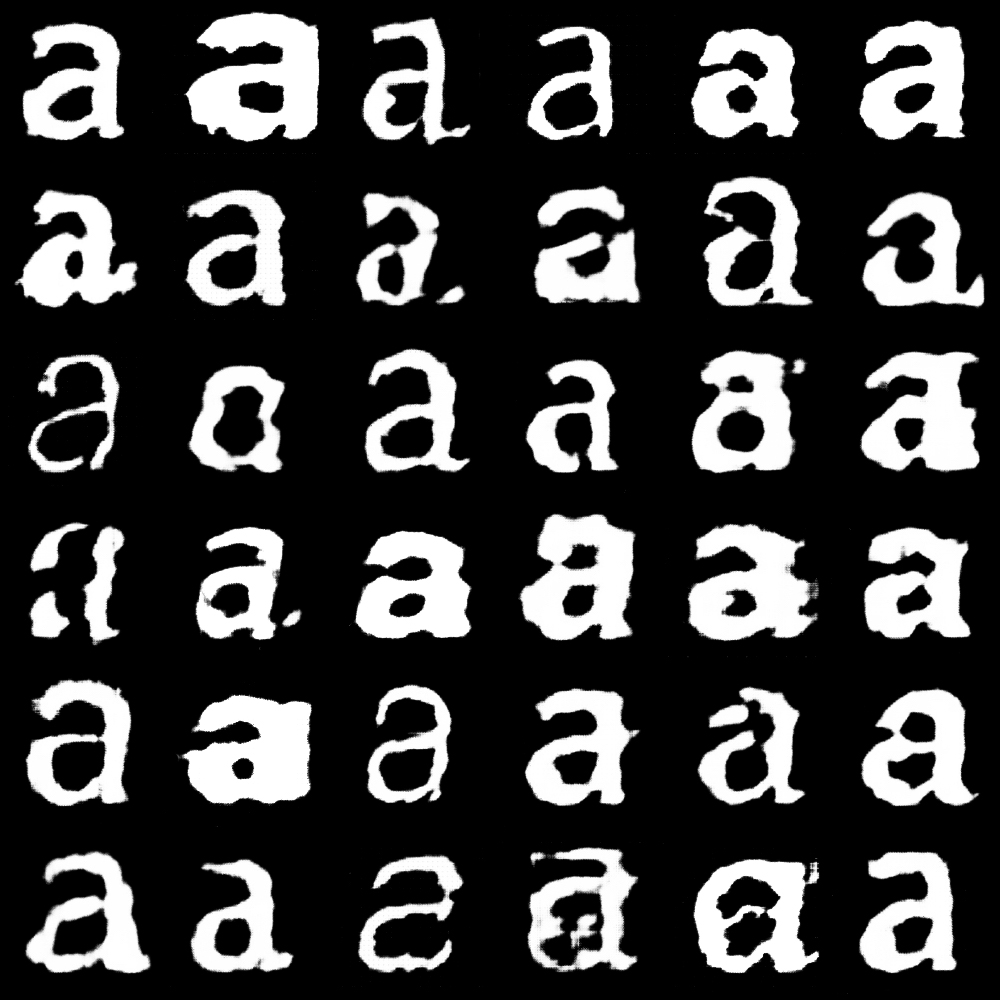

# GlyphGAN



GlyphGAN uses a DCGAN architecture to learn and generate synthetic glyph images. This project explores the application of machine learning techniques to typography and glyph design.

DCGAN stands for Deep Convolutional Generative Adversarial Network, a class of neural networks that uses convolutional layers in both the generator and discriminator to create and evaluate synthetic images.

### Features

- PyTorch implementation of DCGAN architecture
- Custom `ImageFolderEX` class for handling glyph datasets
- GPU acceleration support
- Discriminator and Generator network implementations
- Training loop with loss tracking
- Image generation from random latent vectors
- Latent space interpolation
- Interpolated latent space video rendering

### Customization

Adjustable hyperparameters:

- Learning rate (`lr`)
- Beta values for Adam optimizer (`beta_1`, `beta_2`)
- Number of training epochs (`epochs`)
- Batch size (`batch_size`)
- Latent vector size (`default 200`)

### Usage

1. Ensure you have Python 3.x installed on your system.

2. Install the required dependencies:
`pip install numpy torch torchvision matplotlib Pillow imageio`

3. If you're using Google Colab, you might need to mount your Google Drive.

4. Prepare your glyph dataset and organize it in the following structure. Update the img_dir variable in the notebook to point to your dataset. (`img_dir = "/path/to/your/dataset/"`)

```
.
└── 1
    ├── img1.jpg
    ├── img2.jpg
    └── img3.jpg
```

5. Run the Jupyter notebook cells sequentially to train the model and generate images. The model will output generated glyph images during training and a final set of generated images.

6. An interpolation video showing transitions between generated glyphs will be created at the end.

### Expected Output

The model generates synthetic glyph images based on the training data. Outputs include:

1. Intermediate results: Generated glyph images displayed during the training process, showing the model's progress.
2. Final generated images: A set of synthetic glyphs produced by the fully trained model.
3. Interpolation video: A visualization showing smooth transitions between different generated glyphs, demonstrating the model's ability to navigate the latent space of glyph designs.

The quality and style of the generated glyphs will depend on your input dataset and chosen hyperparameters.

### Credits

Builds upon and extends the original architecture by Ritchie Vink:

https://www.ritchievink.com/blog/2018/07/16/generative-adversarial-networks-in-pytorch-the-distribution-of-art/
